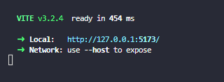

# ***STUDYBEATSFM 🎶 - An Online music player***

## **Overview**

An app that allows you to browse different music channals all in one convient place. Whether you're studying or coding, all of your music needs are at your finger tips. Don’t want to listen to any music? The app comes equipped with ambient noise sound dials that allow you to have rain, ocean sounds or white noise in the background. 

## **Preview** - [Live Site](https://study-beat-fm.web.app)

### *Intro*


### *Main Interface*


## Features ⭐ 

- 12 unique music radios 
- Fully functional audio control 
- Slick UI
- High quality audio 
- Rain, Ocean and White noise dial
- Social link to each Youtube channel 

## **Tools 🛠️**

- [Vite (React)](https://vitejs.dev/)
- [Framer Motion](https://www.framer.com/motion/)

## **Settings**

### *Step 1*
```css
    git clone [myLinkProjectGitHub]
```

### *Step 2*
```css
    cd [project]
```

### *Step 3*
```css
    npm install
```

### *Step 4*
```css
    npm run dev
```

### And your project will be run like this


### You can open in host:
```css
    localhost:5173
```

### Live: https://study-beat-fm.web.app
